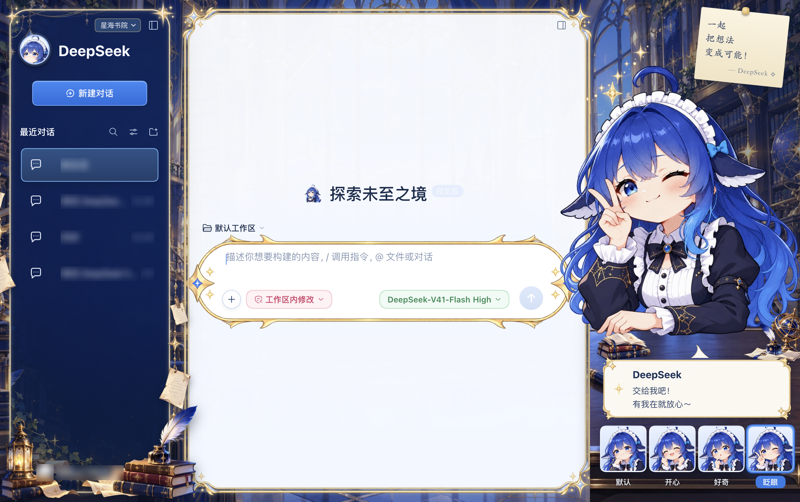
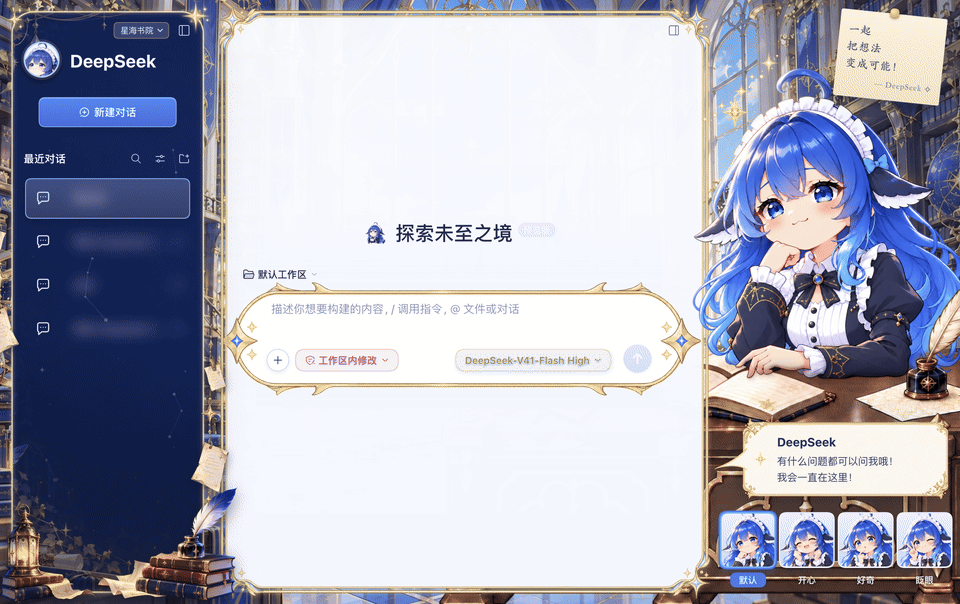

# DeepSeek Harness「星海书院」皮肤

> **非官方项目**：这是 DeepSeek Harness 桌面版（macOS）的本地皮肤插件，与 DeepSeek 官方无关；只改外观，不修改应用本体和签名。





## 快速安装

- **只想用**：拿到分享包 `星海书院皮肤-v<版本>.zip`，解压后双击 `安装.command`，再完全退出（`Cmd+Q`）并重新打开 DeepSeek Harness。详细步骤、被系统拦截时的处理、手动安装和卸载见包里的 [`使用说明.md`](share/使用说明.md)。不需要 Node 或 Python。
- **交给 DeepSeek Harness 安装**：把 `使用说明.md` 拖进对话框，权限切到「完全权限」，让它按说明里「给 AI 助手的安装步骤」安装——它会先备份 `~/.dsh/profiles/desktop` 里要改的两处，装完提醒你 `Cmd+Q` 重开，并告诉你快捷键（`Option+Shift+B` 会隐藏全部界面，再按一次恢复）。
- **从源码安装**：需要 Node.js（构建时缩放素材还要 Python 3 + Pillow）。在项目目录运行 `node tools/install.mjs --apply`（会先构建），然后重启应用。卸载：`node tools/install.mjs --revert`。

两种方式都只写用户目录里的两处：`~/.dsh/profiles/desktop/node_modules/@local/dsh-logo/`（插件文件）和 `~/.dsh/profiles/desktop/cordis.patch.yml`（追加一条加载项）。

## 界面

| 区域 | 内容 |
| --- | --- |
| 背景 | 全窗口书院全景（白天通透版） |
| 左侧栏 | 悬浮金边卡片，深蓝底上有隐约的随机星图；圆形头像 + DeepSeek 字标；油灯、书本羽毛笔、两侧挂着的书页；顶部有皮肤下拉菜单 |
| 对话框 | 金边九宫格边框，白底按边框内侧形状裁切；文件 / 终端 / 浏览器右侧面板同样有金边 |
| 输入框 | 高清胶囊金边，随输入框高度等比缩放 |
| 右侧陪伴栏 | 便签、角色坐在书桌前（固定书桌 + 人物层，书桌延伸到对话框下面）、对话气泡、四个表情（默认 / 开心 / 好奇 / 眨眼）；切换时角色往上顶一下、头部闪出星光 |

| 操作 | 说明 |
| --- | --- |
| 左侧栏顶部「星海书院 ▾」 | 在皮肤和原版界面之间切换，选择会记住 |
| 右下角表情缩略图 | 切换表情和台词，选择会记住 |
| `Option + Shift + F` | 收起 / 展开右侧陪伴栏 |
| `Option + Shift + B` | 只看背景 |

窗口宽度小于 1100px 时陪伴栏自动隐藏。皮肤开启时注册并选中一个不持久化的浅色主题，关闭皮肤后恢复原来的主题偏好。

## 项目结构

| 路径 | 内容 |
| --- | --- |
| `brand-override/skin.css` | 基础布局与样式（`$SKIN` 构建时展开） |
| `brand-override/skin-art.css` | 素材装饰层：每段只在 `logo.config.json` 配了对应素材时生效 |
| `brand-override/client.js` | 插件逻辑：皮肤下拉菜单、快捷键、侧栏文案、陪伴栏与表情切换、浅色主题 |
| `logo.config.json` | 素材路径、表情列表与气泡文案、包体上限 |
| `assets/` | 皮肤用到的图片：背景、侧栏、边框（`ui/`）、陪伴栏书桌与人物层（`combo/`） |
| `tools/build.mjs` / `verify.mjs` / `install.mjs` | 构建（素材内联进 `brand-override/dist/client.js`）、自检、安装 / 卸载 |
| `tools/backup.mjs` | 改动前备份项目和已安装插件，可一键还原 |
| `tools/devtools.mjs` | 连接调试端口：执行 JS、截图、实时注入 CSS |
| `tools/char_layers.py` | 生成陪伴栏的人物层、桌面阴影、固定书桌和前景层 |
| `tools/package_share.sh` | 制作分享包（安装包 + 源码包） |
| `share/` | 分享包里的一键安装 / 卸载脚本和使用说明 |
| `docs/交接说明.md` | 项目现状、流程、结构、待办（新会话 / 新协作者先读） |
| `docs/修改记录.md` | 复现步骤、调试方法、踩坑表、完整版本记录 |

## 修改流程

1. `node tools/backup.mjs <说明>` 先备份。
2. 改 `brand-override/skin.css` / `skin-art.css` / `client.js`，或换 `assets/` 里的图并改 `logo.config.json`。
3. `node tools/build.mjs && node tools/verify.mjs`（全部通过才继续）。
4. `node tools/install.mjs --apply`，完全退出并重新打开 DeepSeek Harness（插件只在启动时加载）。
5. 在 `docs/修改记录.md` 的「版本记录」最上面记一条。

调试方法（调试端口、截图、实时注入样式）见 `docs/交接说明.md` 第 6 节。

## 制作分享包

```bash
tools/package_share.sh <输出目录> [预览图目录]
```

生成 `星海书院皮肤-v<版本>.zip`（已构建的插件 + 一键安装 / 卸载脚本 + 使用说明 + 预览图）和 `星海书院皮肤-v<版本>-源码.zip`（当前 git 提交）。预览截图要先遮掉会话标题、账号头像和昵称。

## 说明

- 图片素材由 AI 生成后加工，仅供个人使用和交流，请勿商用。
- 皮肤基于 2026 年 9–10 月的 DeepSeek Harness 桌面版制作；应用改版后页面结构变化，部分样式可能需要调整选择器（用 `data-slot`、`data-*`、`role` 等属性，不用会变的哈希类名）。
- 替换 Dock / 访达里的应用图标（`tools/install_app_icon.py`、`tools/swap-app-icon.command`）和皮肤安装无关：它会改写 `/Applications/DeepSeek Harness.app` 并重新签名，普通使用者不需要运行。
